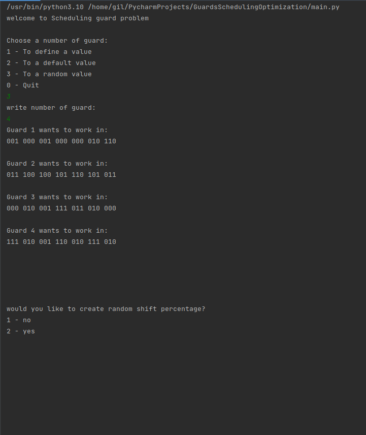
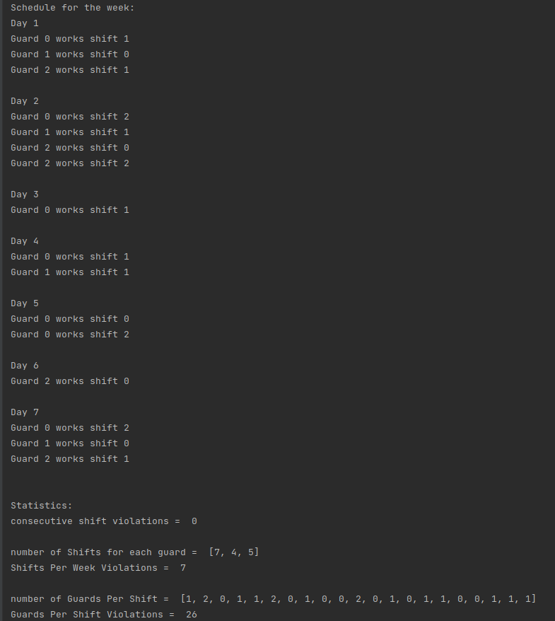

# GuardsSchedulingOptimization
guards scheduling optimization

## About
I built a program to solve a scheduling problem using optimization algorithms such  as  Integer Programming, Hill Climb with N random start, Genetic algorithm.
 
## View

## Installing
- python and install the requirements.txt file.

## Run:
* pip install -r requirements.txt
* python main.py

## Links:
My GitHub project https://github.com/GilAvraham2909/GuardsSchedulingOptimization

## Owners:
* Gil Avraham, Git: https://github.com/GilAvraham2909
